<div align="center">

# DataForge

**A configuration-driven platform for turning documents into traceable knowledge assets and published AI application configurations.**

[简体中文](README.zh-CN.md) · [Documentation](#documentation) · [Architecture](#architecture) · [Quick start](#quick-start)


</div>


DataForge sits between raw enterprise data and AI applications. It provides a visual workspace for defining knowledge schemas, composing and validating DataFlow pipelines, producing versioned knowledge assets, building vector indexes, tuning retrieval, and publishing stable application configurations.

The project is designed for teams that want application code to remain stable while knowledge sources, retrieval policies, prompts, and model endpoints evolve through configuration.

> [!IMPORTANT]
> DataForge is under active development and should currently be treated as an alpha release. The core document-to-RAG path is functional; production hardening, access control, evaluation, and large-scale workload support are still evolving.

## Why DataForge

- **Configuration first** — schemas, pipelines, index projections, retrieval policies, prompts, and model resources are managed in the console.
- **Traceable by design** — source versions, processing runs, knowledge records, physical indexes, collections, and published configurations remain linked.
- **DataFlow-native processing** — DataForge wraps [OpenDCAI DataFlow](https://github.com/OpenDCAI/DataFlow) operators and pipelines with validation, versioning, and publishing semantics.
- **Pluggable AI runtime** — connect OpenAI-compatible LLM, Embedding, and Reranker endpoints without embedding provider-specific code in business applications.
- **Stable application delivery** — downstream applications consume a stable `app_key` and can follow the current release or pin a historical configuration.
- **Local-first deployment** — metadata, files, model endpoints, Milvus, and optional graph storage can run inside a private environment.

## Product tour

<table>
  <tr>
    <td width="50%">
      
      <br /><sub><b>Operations overview</b> — production progress, environment readiness, and the next action in one place.</sub>
    </td>
    <td width="50%">
      
      <br /><sub><b>Application configuration</b> — bind knowledge, debug RAG behavior, validate, and publish a stable configuration.</sub>
    </td>
  </tr>
</table>

## End-to-end workflow

```mermaid
flowchart LR
    A["Documents and structured files"] --> B["Versioned sources"]
    B --> C["Knowledge schema"]
    C --> D["DataFlow pipeline"]
    D --> E["Traceable knowledge assets"]
    E --> F["Embedding and indexes"]
    F --> G["Retrieval profile"]
    G --> H["Published collection"]
    H --> I["Application configuration"]
    I --> J["Business applications"]
```



The currently verified reference path uses Text2QA, `bce-embedding-base`, Milvus, configurable retrieval, and an OpenAI-compatible chat model. Model names and endpoints are deployment configuration, not platform assumptions.

## Core capabilities

| Area | Capabilities |
|---|---|
| Source management | Content hashing, immutable versions, duplicate detection, preview, download, and source metadata |
| Parsing | PDF, CSV, XLSX, Markdown, DOCX, TXT, JSON, and JSONL |
| Knowledge schemas | Versioned output contracts for text chunks, FAQ records, knowledge triples, and multi-turn conversations |
| Pipeline governance | DataFlow operator composition, sample execution, compatibility checks, immutable snapshots, validation, publishing, and default-version switching |
| Knowledge production | Multi-document jobs, per-document state, cancellation, retry, recovery after restart, schema validation, and transactional publication |
| Lineage | Source version, processing run, PDF page, CSV/XLSX row, DOCX paragraph or table row, and character ranges |
| Indexing | Configurable embedding text, stored fields, metadata, scalar filters, Milvus indexes, optional Neo4j targets, batching, checkpoints, and rebuilds |
| Retrieval | Top K, score threshold, filters, optional reranking, selected return fields, context templates, citations, and audit details |
| Delivery | Immutable knowledge collections, current or pinned versions, stable application keys, RAG debugging, prompt configuration, and published runtime contracts |
| Runtime APIs | Configuration retrieval, authenticated synchronous invocation, SSE streaming, citations, token usage, and execution records |

## Architecture


DataForge separates durable knowledge assets from their projections and consumers:

- the **Web Console** manages configuration and operations;
- the **FastAPI service layer** owns versioning, validation, orchestration, and public contracts;
- **DataFlow** executes document and model-assisted processing pipelines;
- **knowledge assets** remain the traceable source of truth;
- **Milvus** stores vector projections and **Neo4j** is an optional graph target;
- **retrieval and application configurations** publish stable interfaces to downstream software.

The validated diagram source is available in [`dataforge.architecture.json`](dataforge.architecture.json), with an explorable HTML artifact in [`dataforge-architecture.html`](dataforge-architecture.html).

## Quick start

### Prerequisites

- Python 3.11 or 3.12
- [uv](https://docs.astral.sh/uv/)
- Node.js and npm
- Docker with Compose, for local Milvus
- A local checkout of [OpenDCAI DataFlow](https://github.com/OpenDCAI/DataFlow)

### 1. Clone DataFlow and DataForge

Keeping both repositories under the same parent directory enables automatic DataFlow discovery.

```bash
git clone https://github.com/OpenDCAI/DataFlow.git
git clone https://github.com/cheney369/DataForge.git
cd DataForge
```

For a different layout, set `DATAFORGE_DATAFLOW_PATH=/absolute/path/to/DataFlow`.

### 2. Install backend dependencies

```bash
uv sync --extra dataflow --extra web --extra studio --extra indexing
```

### 3. Start Milvus

```bash
docker compose -f infra/milvus/docker-compose.yml up -d
```

### 4. Build the web interfaces

```bash
cd frontend
npm install
npm run build

cd ../third_party/dataflow_webui/frontend
npm install
npm run build

cd ../../..
```

### 5. Start DataForge

```bash
uv run --extra dataflow --extra web --extra studio --extra indexing dataforge-web
```

Open [http://127.0.0.1:8000](http://127.0.0.1:8000). OpenAPI documentation is available at [http://127.0.0.1:8000/docs](http://127.0.0.1:8000/docs).

## Model and storage configuration

DataForge supports OpenAI-compatible model services. The defaults are local placeholders and can be changed in the console or with environment variables.

```bash
export DATAFORGE_LLM_BASE_URL=http://127.0.0.1:8001/v1
export DATAFORGE_LLM_MODEL=Qwen3-32B

export DATAFORGE_EMBEDDING_BASE_URL=http://127.0.0.1:8002/v1
export DATAFORGE_EMBEDDING_MODEL=bce-embedding-base
export DATAFORGE_EMBEDDING_DIMENSION=768

export DATAFORGE_RERANKER_BASE_URL=http://127.0.0.1:8197/v1
export DATAFORGE_RERANKER_MODEL=bge-reranker-large

export DATAFORGE_MILVUS_URI=http://127.0.0.1:19530
```

Secrets are referenced by environment-variable name and are not stored in published configuration snapshots.

## Application integration

Read the current published configuration with a stable application key:

```bash
curl http://127.0.0.1:8000/v1/application-configs/my-assistant
```

Invoke a published application:

```bash
curl -X POST http://127.0.0.1:8000/v1/apps/my-assistant/invoke \
  -H 'Authorization: Bearer <APPLICATION_API_KEY>' \
  -H 'Content-Type: application/json' \
  -d '{"inputs":{"query":"What does this knowledge base contain?"}}'
```

Applications can also call a pinned version and request Server-Sent Events. See [AI application publishing and invocation](docs/ai-applications.md) for the full contract.

## Operations and verification

```bash
# Environment and dependency diagnostics
uv run dataforge doctor --deep

# HTTP health and readiness smoke test
uv run dataforge smoke --url http://127.0.0.1:8000

# Backend test suite
uv run --with pytest --extra dataflow --extra web --extra studio --extra indexing pytest -q

# Main frontend production build
cd frontend && npm run build
```

For a single-server deployment template, systemd example, persistence layout, and readiness probes, see [Deployment](infra/deploy/README.md).

## Documentation

- [DataFlow integration and adapter boundaries](docs/dataflow-integration.md)
- [Indexing and retrieval configuration](docs/indexing-and-retrieval.md)
- [Knowledge collections and delivery](docs/knowledge-collections-and-delivery.md)
- [AI application publishing and invocation](docs/ai-applications.md)
- [Release notes](docs/releases/release-notes.md)

## Current limitations

- Scanned PDFs require an external OCR or MinerU deployment; native parsing reads existing text layers.
- Legacy `.doc` files are not converted; use `.docx`.
- Large multi-process workloads still need a durable distributed task queue and broader throughput testing.
- Hybrid vector/graph retrieval, automated evaluation, rate limiting, quotas, and tool-using agents are not yet complete.
- Authentication, role-based access control, and multi-tenant isolation are not production-ready.

## Roadmap

- activate MinerU/OCR as an optional structured PDF parser;
- add database and HTTP API source connectors;
- expand hybrid vector, keyword, and graph retrieval;
- provide evaluation datasets, regression checks, and retrieval quality dashboards;
- add durable workers, scheduling, and larger-scale deployment patterns;
- publish lightweight Python and JavaScript application clients;
- complete authentication, authorization, and audit hardening.

## Contributing

Issues and pull requests are welcome. For a significant change, open an issue first and describe the problem, expected behavior, and proposed compatibility impact. Please include tests for backend behavior and run the relevant frontend production build before submitting a pull request.

## License

An open-source license has not yet been selected. Until a `LICENSE` file is added, the repository is available for evaluation and collaboration, but no additional usage rights are granted by default.
