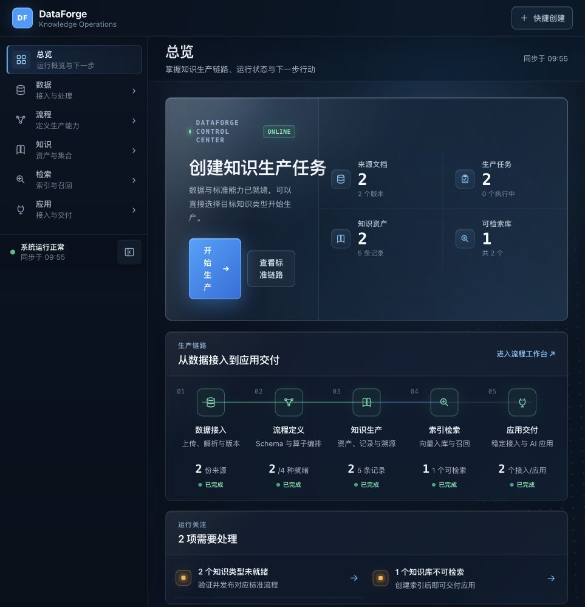
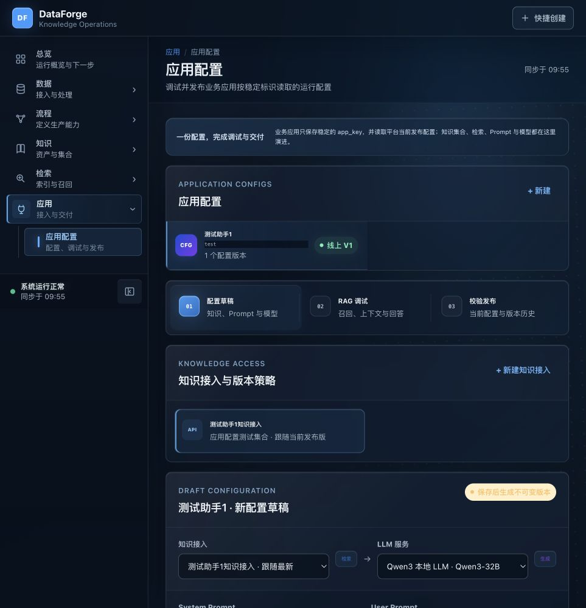
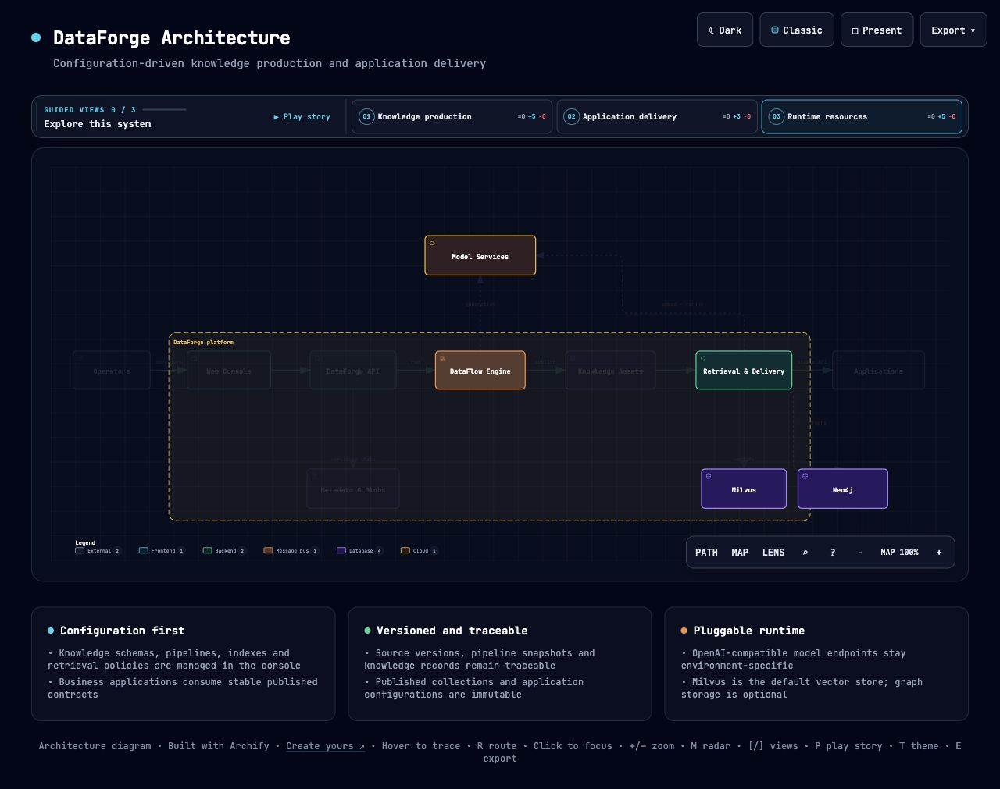

<div align="center">

# DataForge

**通过配置将文档加工为可追溯知识资产，并向 AI 应用发布稳定运行配置。**

[English](README.md) · [项目文档](#项目文档) · [系统架构](#系统架构) · [快速开始](#快速开始)


</div>


DataForge 位于原始数据与 AI 应用之间，提供一套可视化、可配置的知识生产工作台：定义知识结构、编排和验证 DataFlow 流程、生产版本化知识资产、构建向量索引、调试检索方案，并发布稳定的应用运行配置。

项目的核心目标是让业务应用代码保持稳定，同时允许知识来源、检索策略、Prompt 和模型服务通过平台配置持续演进。

> [!IMPORTANT]
> DataForge 当前处于 Alpha 阶段。文档到 RAG 应用配置的核心链路已经可运行，生产级权限、自动评测、大规模任务和运维增强仍在持续建设。

## 为什么选择 DataForge

- **配置优先**：Schema、Pipeline、索引投影、检索策略、Prompt 和模型资源统一在页面管理。
- **全链路可追溯**：源文件版本、处理任务、知识记录、物理索引、知识集合和发布配置相互关联。
- **复用 DataFlow**：使用 [OpenDCAI DataFlow](https://github.com/OpenDCAI/DataFlow) 算子与 Pipeline，并补充平台侧的验证、版本和发布语义。
- **模型服务可替换**：支持 OpenAI 兼容的 LLM、Embedding 和 Reranker 服务，业务代码不依赖具体模型供应商。
- **稳定应用交付**：应用只依赖稳定 `app_key`，可以自动跟随当前发布版，也可以固定历史版本。
- **本地优先部署**：元数据、文件、模型、Milvus 和可选图数据库均可部署在私有环境。

## 产品界面

<table>
  <tr>
    <td width="50%">
      
      <br /><sub><b>运行总览</b>：集中展示生产进度、资源就绪状态和下一步操作。</sub>
    </td>
    <td width="50%">
      
      <br /><sub><b>应用配置</b>：绑定知识、调试 RAG、校验并发布稳定配置。</sub>
    </td>
  </tr>
</table>

## 完整链路


当前参考链路已经使用 Text2QA、`bce-embedding-base`、Milvus、可配置检索和 OpenAI 兼容对话模型完成验证。模型名称和服务地址属于部署配置，不是平台硬编码依赖。

## 核心能力

| 领域 | 能力 |
|---|---|
| 数据来源 | 内容哈希、不可变版本、重复检测、预览、下载和来源元数据 |
| 文件解析 | PDF、CSV、XLSX、Markdown、DOCX、TXT、JSON 和 JSONL |
| 知识结构 | 文本块、FAQ、知识三元组和多轮对话的版本化输出契约 |
| 流程治理 | DataFlow 算子编排、样本运行、兼容校验、冻结快照、验证、发布和默认版本切换 |
| 知识生产 | 多文档任务、逐文档状态、取消、重试、重启恢复、Schema 校验和事务发布 |
| 数据溯源 | 源版本、处理任务、PDF 页码、CSV/XLSX 行、DOCX 段落或表格行以及字符范围 |
| 索引管理 | 向量文本模板、Stored Fields、Metadata、标量过滤、Milvus、可选 Neo4j、批处理和重建 |
| 检索管理 | Top K、阈值、过滤条件、可选 Reranker、返回字段、上下文模板、引用与运行审计 |
| 应用交付 | 不可变知识集合、当前或固定版本、稳定应用标识、RAG 调试、Prompt 和运行契约发布 |
| 运行接口 | 配置读取、鉴权同步调用、SSE 流式输出、引用、Token 用量和执行记录 |

## 系统架构



DataForge 将事实知识、索引投影和应用消费分层管理：

- **Web Console** 负责配置和运行管理；
- **FastAPI 服务层** 负责版本、校验、编排和公开契约；
- **DataFlow** 执行文档处理和模型算子 Pipeline；
- **知识资产** 是可追溯的事实来源；
- **Milvus** 保存向量投影，**Neo4j** 是可选图索引目标；
- **检索与应用配置** 向业务软件发布稳定接口。

架构图源文件见 [`dataforge.architecture.json`](dataforge.architecture.json)，可交互 HTML 版本见 [`dataforge-architecture.html`](dataforge-architecture.html)。

## 快速开始

### 环境要求

- Python 3.11 或 3.12
- [uv](https://docs.astral.sh/uv/)
- Node.js 与 npm
- Docker Compose，用于本地 Milvus
- [OpenDCAI DataFlow](https://github.com/OpenDCAI/DataFlow) 本地源码

### 1. 获取代码

将 DataFlow 与 DataForge 放在同一父目录下可以自动发现 DataFlow。

```bash
git clone https://github.com/OpenDCAI/DataFlow.git
git clone https://github.com/cheney369/DataForge.git
cd DataForge
```

若目录不同，请设置 `DATAFORGE_DATAFLOW_PATH=/absolute/path/to/DataFlow`。

### 2. 安装后端依赖

```bash
uv sync --extra dataflow --extra web --extra studio --extra indexing
```

### 3. 启动 Milvus

```bash
docker compose -f infra/milvus/docker-compose.yml up -d
```

### 4. 构建前端

```bash
cd frontend
npm install
npm run build

cd ../third_party/dataflow_webui/frontend
npm install
npm run build

cd ../../..
```

### 5. 启动 DataForge

```bash
uv run --extra dataflow --extra web --extra studio --extra indexing dataforge-web
```

访问 [http://127.0.0.1:8000](http://127.0.0.1:8000)，OpenAPI 文档位于 [http://127.0.0.1:8000/docs](http://127.0.0.1:8000/docs)。

## 模型与存储配置

模型服务默认使用本地占位地址，可以在页面修改，也可以使用环境变量：

```bash
export DATAFORGE_LLM_BASE_URL=http://127.0.0.1:8001/v1
export DATAFORGE_LLM_MODEL=Qwen3-32B

export DATAFORGE_EMBEDDING_BASE_URL=http://127.0.0.1:8002/v1
export DATAFORGE_EMBEDDING_MODEL=bce-embedding-base
export DATAFORGE_EMBEDDING_DIMENSION=768

export DATAFORGE_RERANKER_BASE_URL=http://127.0.0.1:8197/v1
export DATAFORGE_RERANKER_MODEL=bge-reranker-large

export DATAFORGE_MILVUS_URI=http://127.0.0.1:19530
```

密钥只保存环境变量名称，不写入发布配置快照。

## 应用接入

通过稳定应用标识读取当前发布配置：

```bash
curl http://127.0.0.1:8000/v1/application-configs/my-assistant
```

调用已发布应用：

```bash
curl -X POST http://127.0.0.1:8000/v1/apps/my-assistant/invoke \
  -H 'Authorization: Bearer <APPLICATION_API_KEY>' \
  -H 'Content-Type: application/json' \
  -d '{"inputs":{"query":"这个知识库包含什么内容？"}}'
```

系统同时支持固定版本调用和 SSE 流式输出，详细契约参见 [AI 应用发布与调用](docs/ai-applications.md)。

## 运维与验证

```bash
uv run dataforge doctor --deep
uv run dataforge smoke --url http://127.0.0.1:8000
uv run --with pytest --extra dataflow --extra web --extra studio --extra indexing pytest -q
cd frontend && npm run build
```

单机服务器部署模板、systemd 示例、持久化目录和就绪探针参见 [部署说明](infra/deploy/README.md)。

## 项目文档

- [DataFlow 集成与适配边界](docs/dataflow-integration.md)
- [索引与检索配置](docs/indexing-and-retrieval.md)
- [知识集合与应用交付](docs/knowledge-collections-and-delivery.md)
- [AI 应用发布与调用](docs/ai-applications.md)
- [更新记录](docs/releases/release-notes.md)

## 当前限制

- 扫描版 PDF 需要外部 OCR 或 MinerU 部署；原生解析只读取已有文字层。
- 旧版 `.doc` 不提供转换，请使用 `.docx`。
- 大型多进程任务仍需要持久化分布式队列和更完整的吞吐压测。
- 混合向量/图检索、自动评测、限流配额和工具型 Agent 尚未完成。
- 登录、角色权限和多租户隔离尚未达到生产要求。

## 路线图

- 启用可选 MinerU/OCR 结构化 PDF 解析；
- 增加数据库与 HTTP API 数据源；
- 增强向量、关键词和图谱混合检索；
- 增加评测数据集、回归检查和检索质量面板；
- 增加持久化 Worker、调度和更大规模部署方案；
- 发布轻量 Python 与 JavaScript 应用客户端；
- 完善认证、授权和审计安全能力。

## 参与贡献

欢迎提交 Issue 和 Pull Request。较大的功能建议请先通过 Issue 说明问题、预期行为和兼容性影响。提交前请补充对应后端测试，并执行相关前端生产构建。

## 许可证

项目尚未选定开源许可证。在仓库增加 `LICENSE` 文件前，代码可用于评估与协作，但默认不授予其他使用权利。
