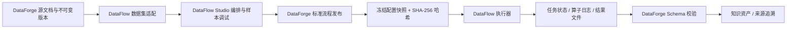

# DataFlow 集成与适配设计

DataForge 把 DataFlow 定位为底层数据处理平台，而不是重新实现一套算子编排和执行系统。DataFlow 负责“如何处理”，DataForge 负责“处理什么、使用哪个已发布版本、产物如何校验和治理、最终交付给谁”。



## 能力划分

| 能力 | DataFlow 现有实现 | DataForge 集成方式 |
|---|---|---|
| Pipeline 编排 | 可视化 DAG、保存、模板、配置校验 | 复用原编辑器核心，通过 `/studio/?embedded=1` 嵌入 DataForge 工作台壳层 |
| 算子管理 | 算子分类、元数据、参数和可用性 | 复用注册表，通过 `/api/dataflow-operators` 提供平台侧查询 |
| 数据集管理 | 注册、列表、预览、字段读取、上传 | DataForge 文件版本物化为 JSONL 后注册，并保留源版本元数据 |
| 任务管理 | 执行、状态、算子进度、日志、结果、终止 | 通过适配层调用公开接口；DataForge 暴露任务列表、详情和取消接口 |
| JSON Schema | Schema 的增删改查 | 先复用查询能力；后续评估与 DataForge 知识类型双向映射 |
| 内置流程 | 文本转问答、多轮对话、SFT、RAG、PDF-VQA、推理、代码和 Text2SQL 等 | 作为流程模板候选，逐个完成依赖检查、样本运行和输出 Schema 验证后发布 |
| Serving / Prompt / Text2SQL | DataFlow 已有管理模块 | 默认 LLM 自动适配为 DataFlow API Serving；其他能力按流程逐项验证后接入 |
| 流程发布治理 | 注册表记录可被后续编辑覆盖，没有不可变 release | 由 DataForge 保存发布时配置快照、配置哈希、样本任务和业务版本 |
| 知识资产与溯源 | 不属于 DataFlow 核心职责 | DataForge 负责关系库入库、记录级来源、后续向量/图索引和应用交付 |

## 适配层原则

集成代码集中在 `src/dataforge/integrations/dataflow.py`，业务服务不直接依赖 DataFlow 的文件布局或私有 `_read` / `_write` 方法。

当前适配层提供：

- Pipeline 列表、详情、静态校验、发布快照和确定性配置哈希；
- 数据集注册、读取与列表；
- 算子、JSON Schema 列表；
- 任务执行、列表、详情、日志、结果摘要和取消；
- 当前环境可用算子、模型 Serving 和冻结流程的运行预检；
- 不同 DataFlow 缓存目录约定下的最终结果文件解析。

DataFlow 原生后端仍挂载在 `/api/v1`，用于内嵌 Studio 的完整功能。DataForge 自身页面和业务逻辑应优先调用 `/api/dataflow-*` 门面，以便后续升级 DataFlow 时只修改适配层。

DataFlow 前端提供独立嵌入模式：隐藏原管理导航和重复的资源入口，保留数据集选择、Pipeline 列表、算子库、DAG 画布、参数编辑、保存与样本运行。DataForge 外层负责运行依赖、当前草稿摘要、静态校验和标准流程发布跳转。双方通过同源 `postMessage` 只交换流程 ID、算子数量和任务状态，不复制编辑器内部状态。

## 标准流程发布语义

发布不只是保存一个可变的 DataFlow Pipeline ID。一次有效发布同时保存：

- `pipeline_ref`：上游流程的逻辑引用；
- `version`：业务可读的标准流程版本；
- `pipeline_snapshot`：发布时的完整 DataFlow 配置；
- `pipeline_hash`：规范化配置的 SHA-256；
- `sample_task_id`：用于输出格式验收的成功任务；
- `output_schema`：该流程承诺产生的知识记录结构。

生产任务执行冻结快照，只在兼容旧数据时回退到当前 Studio 配置。因此，技术人员可以继续修改 Studio 草稿，而已经发布的标准流程不会随之漂移。

## 当前限制与后续处理

1. DataFlow 的任务注册表和部分缓存仍是共享文件。适配层暂时串行执行 DataForge 发起的 Studio 流程，避免并发任务覆盖中间结果。后续应推动上游实现任务级缓存目录和原子注册表更新，再恢复并行。
2. 算子注册时会跳过未安装可选依赖的算子。下一步需要把“可用、缺依赖、缺模型配置”作为显式能力状态展示，而不是只依赖启动日志。
3. 内置 Pipeline 是模板候选，不等于可以直接作为正式流程。每条流程必须完成依赖检查、真实样本执行、输出 Schema 验证和版本发布。
4. DataFlow 的 Prompt、Agent、Text2SQL 等能力继续保留在 Studio，只有完成依赖检查、样本执行和输出契约验证的流程才进入 DataForge 业务导航。

## 任务可靠性与取消语义

知识生产任务会为每个源文档版本建立独立执行项，并记录本地 Run、资产版本或 DataFlow Task 的关联。业务任务取消时：

- 等待执行的文档不再进入 Pipeline；
- 已创建的 DataFlow Task 会通过适配层请求终止；
- 对无法立即中断的同步算子采用协作式取消，允许当前调用返回，但跳过格式验收与知识库发布；
- 取消检查与最终知识库发布使用数据库事务串行化，避免出现“任务已取消但知识库仍被发布”的状态；
- 取消和失败的原尝试保持不可变，重试会创建新的 attempt 并串联审计关系。

应用进程启动时会把上次进程遗留的等待中或运行中尝试转为失败，并保留逐文档状态和可读错误，随后可从原任务创建新尝试。当前恢复粒度是“整次尝试重跑”，尚未实现从某个算子或某条记录断点续跑。

每个知识生产任务还保存独立事件时间线，覆盖创建、开始、逐文档处理、输出校验、资产发布、取消、失败和服务重启恢复。DataFlow 执行完成时会提取算子完成数量作为业务可读摘要，底层日志和中间结果仍由调试台提供。

## 运行健康检查

`GET /api/dataflow-health` 返回脱敏的结构化健康报告，包括：

- DataFlow 后端和可视化调试台是否就绪；
- 当前成功加载的算子数量；
- 可用模型 Serving 数量，不返回密钥；
- 每个 DataFlow Studio 标准流程需要的算子、缺失算子、Serving 绑定和当前可运行状态。

标准流程发布和正式知识任务创建都会再次执行相同预检。这样环境依赖或模型密钥发生变化时，系统会在执行前明确阻止不可运行的流程，而不是等任务进入后才以导入异常或空结果失败。

已发布标准流程版本保存冻结快照后不可原地覆盖；同名流程必须使用更高版本发布。停用版本继续保留历史任务和资产引用，但不再进入默认流程选择或新任务执行。

## 已打通的基准通道

当前已经打通 `DataForge 基础文本标准化与分块`：

- 启动时将 `NormalizeMedicalTextOperator` 和 `ChunkMedicalTextOperator` 注册到 DataFlow 算子中心；
- 首次安装时在 Studio 创建带 `dataforge:basic-text-v1` 身份标签的可编辑 Pipeline；
- 使用内置医疗文本样本完成一次真实 DataFlow 执行和输出 Schema 验证；
- 将验证通过的配置冻结发布为默认 `std-text-chunk-v1` 标准流程；
- 后续文档加工通过冻结快照执行，Studio 中的修改保留为草稿，必须显式重新发布才会影响生产任务。

这条通道不依赖 LLM、GPU 或第三方 API，可作为 Text2QA、多轮对话、SFT 等模型型 Pipeline 后续接入时的运行基线。

## Text2QA 通道

`DataForge 文档转 FAQ（Text2QA）` 已作为第二条 Studio Pipeline 配置完成，处理顺序为：

1. `NormalizeMedicalTextOperator`：统一文档文本；
2. `ChunkMedicalTextOperator`：生成适合问答生成的文本片段；
3. DataFlow `Text2QAGenerator`：输出标准 `question` 与 `answer` 字段；
4. DataFlow `Text2QASampleEvaluator`：评估问题质量、答案一致性、可验证性和下游价值。

DataForge 启动时会把当前默认 OpenAI 兼容 LLM 自动映射为 DataFlow `APILLMServing_request`，只向 DataFlow 注册表保存脱敏配置，密钥通过进程环境传递。当前 `Qwen3-32B` API 已完成真实样本执行，流程状态为 `validated`，不需要在 DataForge 服务器本地部署 32B 模型。

没有可用模型服务时，该标准流程保持 `configured`，业务侧不能误用。需要切换到其他 Serving，或存在多个 Serving 时，可调用：

```text
POST /api/dataflow-text2qa/activate?serving_id=<serving-id>
```

接口会绑定指定 Serving、执行内置样本、验证 FAQ Schema，并在成功后把流程更新为 `validated`。只有一个可用 Serving 时可以省略 `serving_id`；存在多个 Serving 时必须明确选择。DataForge 的 Serving 查询门面只返回模型名称、脱敏后的 API 地址和就绪状态，不返回 API Key。

当前 Text2QA 配置对每个文本分块至少发起 6 次 LLM 调用：生成提示词和问答各 1 次，问题质量、答案一致性、可验证性和下游价值评估各 1 次。因此它主要消耗远程模型吞吐与调用时延，分块数量、并发和超时需要按模型服务能力控制。

任务结果预览优先读取 DataFlow 按任务隔离的 `{task_id}_output` 缓存目录，并兼容旧版共享缓存命名。历史 Text2QA 和基础文本任务因此可以在原生任务详情与 DataForge 门面中直接查看实际样本，而不再只显示完成状态。

## 多轮对话通道

`DataForge 多轮对话数据生成` 已作为可编辑 Studio 草稿配置完成：

1. DataFlow `ConsistentChatGenerator` 使用当前 OpenAI 兼容 LLM 生成多轮对话；
2. `ConversationSchemaAdapterOperator` 把上游 `conversation` 结构转换为统一 `messages` 数组；
3. 同时生成稳定 `dialogue_id` 和 `turn_count`，便于后续索引、过滤和上下文窗口设计。

调试默认值为每种意图 1 条、每条 4 轮、温度 0.7，用于先验证格式和模型兼容性。启动只配置草稿，不会自动消耗模型调用；需要在调试台手动运行样本并通过 `multi_turn_dialogue` Schema 验证后再发布。也可重新绑定 Serving：

```text
POST /api/dataflow-conversation/configure?serving_id=<serving-id>
```

## 算子资源分层

DataFlow 的“算子已加载”不代表每个算子都必须在本机部署模型。资源需求取决于实际发布的 Pipeline：

| 算子类型 | 典型能力 | 模型与资源需求 |
|---|---|---|
| 规则与结构处理 | 文本标准化、分块、字段映射、过滤、格式转换 | 不需要模型或 GPU，主要使用 CPU、内存和磁盘 |
| API 模型算子 | Text2QA、推理、SFT 数据生成、Text2SQL、部分 RAG 处理 | 调用 OpenAI 兼容 LLM/VLM API；DataForge 本机无需模型权重和 GPU，但需要网络、并发与超时配置 |
| Embedding / 语义算子 | 向量生成、语义去重或相似度 | 可调用现有 `bce-embedding-base` API；只有选择本地实现时才需要 Torch、模型权重和相应 CPU/GPU |
| 本地模型算子 | vLLM、SGLang、Transformers 推理 | 需要对应运行时、模型权重、GPU 显存与缓存空间，需求随模型精度、上下文和并发变化 |
| 专用多模态算子 | MinerU/OCR、PDF-VQA、视觉、语音、化学等 | 只在启用对应流程时安装专用依赖和模型；当前未启用不会阻塞基础文本与 Text2QA 通道 |

当前 DataForge 的基础文本通道仅使用 CPU；Text2QA 使用远程 `Qwen3-32B` API；Embedding 和 Reranker 也使用已配置的远程 API。启动日志中的可选算子导入失败表示该类扩展能力被跳过，不影响已经通过健康检查的标准流程。

## 推荐开发顺序

1. 完成文本清洗/分块主链路和发布快照闭环。
2. 在已配置的多轮对话草稿上运行真实模型样本，检查对话质量并发布标准流程。
3. 增加算子依赖与运行环境健康检查。
4. 继续完善算子级日志、心跳租约和大任务断点续跑。
5. 再进入向量/图索引、知识集合和检索服务。
